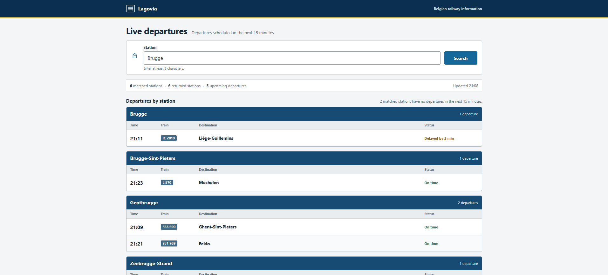
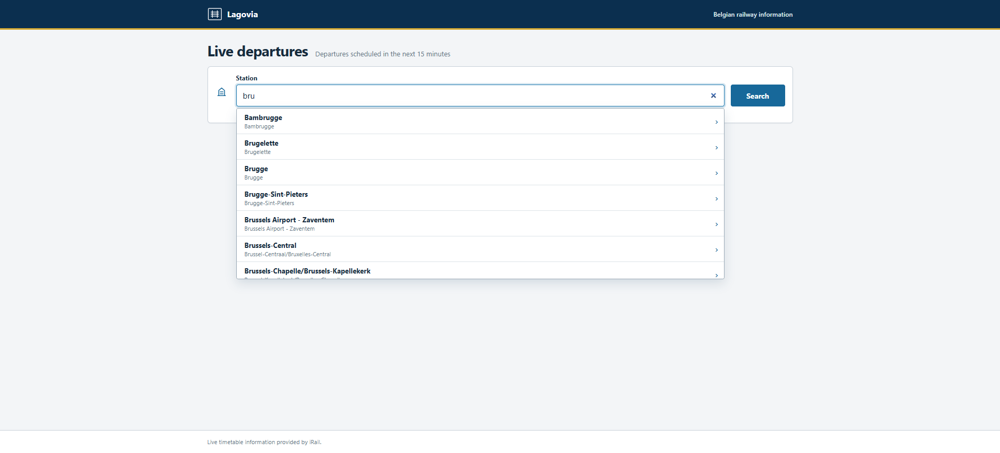
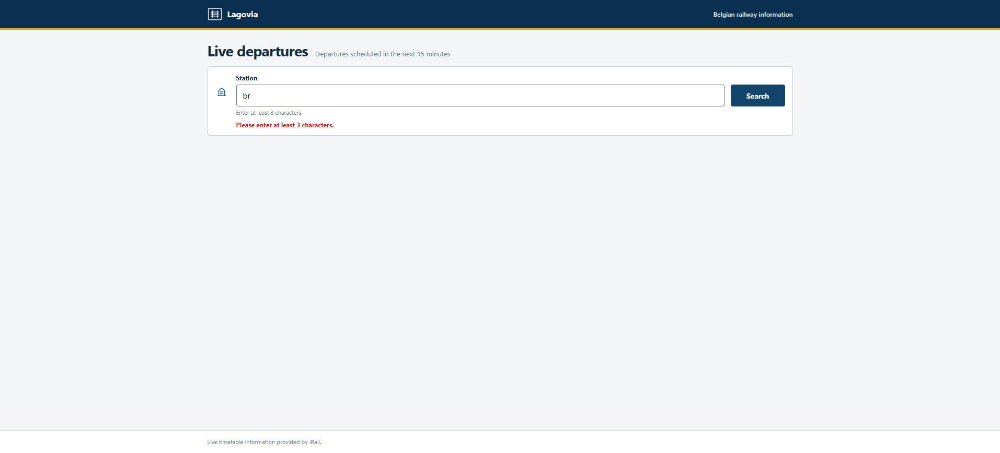
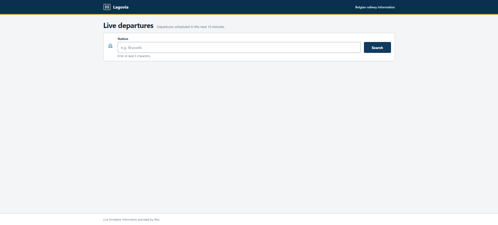

# Lagovia Train Tracker

A full-stack Belgian railway departure tracker built for the DPS technical challenge.

Users can enter part of a station name and view trains scheduled to depart within the next 15 minutes from every matching station. The React frontend consumes one Express feature endpoint, while the backend retrieves and normalizes live timetable data from the public iRail API.

## Live Demo

- **Frontend:** https://lagovia-train-tracker.vercel.app
- **Backend API:** https://lagovia-train-tracker-api.vercel.app
- **Health check:** https://lagovia-train-tracker-api.vercel.app/health
- **Example search:** https://lagovia-train-tracker-api.vercel.app/api/departures?q=Bru

## Application Preview

### Live Departures



### Station Autocomplete



### Search Validation



### Initial Search



## Features

- Case-insensitive substring search across Belgian station names
- Local, keyboard-accessible station autocomplete
- Departures grouped by origin station
- Inclusive 15-minute scheduled-departure window
- Train number, destination, scheduled time, delay, and cancellation status
- Partial upstream-failure handling with warnings
- Raw iRail Liveboard caching for 12 seconds
- In-flight request deduplication and controlled request batching
- Responsive railway-board interface using 24-hour time
- Automated endpoint, service, cache, utility, and configuration tests

## Tech Stack

### Backend

- Node.js 22
- Express
- TypeScript
- Vitest
- Supertest

### Frontend

- React
- TypeScript
- Vite
- CSS

### External Data Source

- [iRail API](https://docs.irail.be/)

## Project Structure

```text
lagovia-train-tracker/
├── client/
│   ├── public/
│   └── src/
│       ├── components/         # Departure-board UI components
│       ├── data/               # Bundled autocomplete station data
│       ├── services/           # Local autocomplete and API requests
│       └── types/              # Frontend response and station types
├── server/
│   ├── src/
│   │   ├── controllers/        # HTTP validation and responses
│   │   ├── routes/             # Express route definitions
│   │   ├── services/           # Search orchestration and iRail access
│   │   ├── types/              # Application and iRail types
│   │   └── utils/              # Filtering and normalization helpers
│   └── tests/                  # Endpoint, service, cache, and utility tests
├── docs/
│   └── screenshots/
├── AI_USAGE.md
├── ARCHITECTURE.md
└── README.md
```

Generated output, dependencies, local environment files, and temporary files are excluded from Git.

## Prerequisites

- Node.js 22
- npm

## Installation

Clone the repository:

```bash
git clone https://github.com/Abdoessam0/lagovia-train-tracker.git
cd lagovia-train-tracker
```

Install backend dependencies:

```bash
cd server
npm ci
```

Install frontend dependencies:

```bash
cd ../client
npm ci
```

## Running Locally

Start the backend in the first terminal:

```bash
cd server
npm run dev
```

Start the frontend in a second terminal:

```bash
cd client
npm run dev
```

Local URLs:

- Frontend: http://localhost:5173
- Backend: http://localhost:3000
- Health check: http://localhost:3000/health

## Environment Variables

Create local `.env` files from the committed examples when needed.

### Frontend

```env
VITE_API_BASE_URL=http://localhost:3000
```

### Backend

```env
PORT=3000
CORS_ORIGIN=http://localhost:5173
```

Real `.env` files must not be committed.

## API

### Search Departures

```http
GET /api/departures?q=Bru
```

The `q` parameter is required. After whitespace is trimmed, it must contain at least three characters. Matching is case-insensitive and checks both the English station name and the iRail standard name.

This is the application's only public feature endpoint. Autocomplete runs locally in the frontend and does not use an additional station or search endpoint.

### HTTP Statuses

| Status | Meaning |
|---|---|
| `200` | Search completed, including empty or partially successful results |
| `400` | Query is missing or shorter than three trimmed characters |
| `502` | The station source failed, or every matching Liveboard request failed |

### Example Success Response

The values below demonstrate the response shape and are not fixed live timetable data.

```json
{
  "query": "Bru",
  "generatedAt": "2026-07-24T18:00:00.000Z",
  "windowMinutes": 15,
  "totalMatchedStations": 1,
  "totalReturnedStations": 1,
  "totalDepartures": 1,
  "partial": false,
  "warnings": [],
  "stations": [
    {
      "stationId": "BE.NMBS.008813003",
      "stationName": "Brussels-Central",
      "departures": [
        {
          "trainNumber": "IC 1234",
          "destination": "Antwerp-Central",
          "scheduledDepartureTime": "2026-07-24T18:10:00.000Z",
          "delayMinutes": 2,
          "cancelled": false
        }
      ]
    }
  ]
}
```

### Validation Errors

Missing query:

```json
{
  "error": {
    "code": "QUERY_REQUIRED",
    "message": "Please provide a station search query."
  }
}
```

Query shorter than three characters:

```json
{
  "error": {
    "code": "QUERY_TOO_SHORT",
    "message": "Please enter at least 3 characters."
  }
}
```

### Upstream Failure

If the station request fails, or every matching Liveboard request fails:

```json
{
  "error": {
    "code": "UPSTREAM_API_ERROR",
    "message": "Train information is temporarily unavailable."
  }
}
```

### Health Check

```http
GET /health
```

This technical endpoint reports that the Express process is available. It does not call iRail.

## Response Fields

| Field | Description |
|---|---|
| `query` | The trimmed substring processed by the backend |
| `generatedAt` | ISO timestamp based on the single shared request time |
| `windowMinutes` | Scheduled-departure window length, currently `15` |
| `totalMatchedStations` | Number of station names matching the substring |
| `totalReturnedStations` | Number of matching stations whose Liveboards succeeded |
| `totalDepartures` | Sum of all filtered departure arrays |
| `partial` | `true` when at least one Liveboard failed and another succeeded |
| `warnings` | Messages describing Liveboards that could not be loaded |
| `stations` | Successful origin-station groups |
| `stationId` | iRail identifier for the origin station |
| `stationName` | Display name for the origin station |
| `departures` | Departures scheduled inside the inclusive request window |
| `trainNumber` | Normalized train short name or number |
| `destination` | Destination station name |
| `scheduledDepartureTime` | Scheduled departure as an ISO timestamp |
| `delayMinutes` | iRail delay converted from seconds to minutes |
| `cancelled` | Normalized cancellation boolean |

## Architecture and Request Flow

```text
React search
  → Express route
  → departures controller
  → departures service
  → cached iRail station list
  → batched iRail Liveboards
  → inclusive 15-minute filter
  → normalized grouped response
  → React departure board
```

Autocomplete follows a separate local flow:

```text
Typed characters
  → bundled station data
  → up to eight suggestions
  → selected station or explicit form submission
  → /api/departures
```

Typing alone does not start the full departure search.

## Key Decisions

- **Route → Controller → Service separation:** routing remains small, HTTP validation stays in the controller, and search orchestration lives in the service.
- **Normalized application data:** the frontend receives a stable model rather than raw iRail fields.
- **One shared `nowMs` per request:** all stations are filtered against the same inclusive interval.
- **`Promise.allSettled` within batches:** one failed Liveboard does not discard successful station results.
- **Batches of three Liveboard requests:** broad searches remain controlled and respectful of the upstream service.
- **Raw Liveboard caching for 12 seconds:** repeated calls reduce upstream work without caching the final filtered response.
- **In-flight Promise deduplication:** concurrent requests for the same station share one upstream request.
- **Local autocomplete:** typing remains responsive while preserving a single public feature endpoint.
- **24-hour time:** railway departures are easier to scan without AM/PM ambiguity.

## Trade-offs and Known Limitations

- Bundled autocomplete data can become stale until the frontend dataset is refreshed.
- The autocomplete dataset increases the frontend bundle size.
- Raw Liveboard data can be up to 12 seconds old.
- Broad substring queries can take longer because every matching station must be processed.
- In-memory caches are not shared between server instances and reset when an instance restarts.
- Search uses substring matching rather than fuzzy matching because core requirements were prioritized.
- Vercel uses separate frontend and backend projects connected through environment variables.

## Testing

Backend:

```bash
cd server
npm test
npm run typecheck
npm run build
```

Frontend:

```bash
cd client
npm run lint
npx --no-install tsc -b
npm run build
```

## Deployment

The repository is deployed as two Vercel projects.

### Production Configuration

Backend project:

- Root Directory: `server`
- Framework: Express
- `CORS_ORIGIN=https://lagovia-train-tracker.vercel.app`

Frontend project:

- Root Directory: `client`
- Framework: Vite
- `VITE_API_BASE_URL=https://lagovia-train-tracker-api.vercel.app`

No real environment files or secrets are committed.

## Accessibility

- Associated label and guidance for the station input
- Arrow Up, Arrow Down, Enter, and Escape support in autocomplete
- Visible keyboard focus states
- Live regions for loading and error feedback
- Semantic headings and grouped result sections
- Text labels in addition to status colors
- Responsive layout without document-level horizontal overflow

## AI Usage

See [AI_USAGE.md](AI_USAGE.md) for the required transparent summary of AI-assisted learning, review, selected prompts, decisions, and verification.

## Data Attribution

Live Belgian railway information is provided by the public [iRail API](https://docs.irail.be/).
